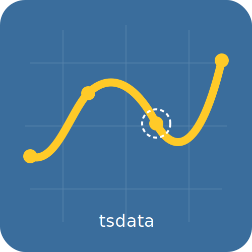

<div align="center">



# Synthetic Time Series Data Generator

[](https://github.com/manojmanivannan/ts-data-generator/actions/workflows/ci.yaml)
[](https://www.python.org/downloads/)
[](./LICENSE)

Generate realistic synthetic time series datasets with configurable dimensions,
metrics, composable trend functions, and injectable anomalies — via a Python API
or the `tsdata` CLI.


</div>

---

## 📚 Documentation

For complete details on features, API reference, CLI usage, and advanced configuration, visit our documentation site:

👉 **[https://manojmanivannan.github.io/ts-data-generator/](https://manojmanivannan.github.io/ts-data-generator/)**

---

## Features

- **Realistic Data:** Mimic real-world time series with trends, seasonality, and noise.
- **Composable Trends:** Layer multiple functions (Sinusoidal, Linear, AR Noise, Markov) to create complex signals.
- **Injectable Anomalies:** Simulate failures with point anomalies, missing data gaps, and concept drifts.
- **Deterministic:** Guaranteed reproducibility via a seedable RNG.
- **CLI & API:** Use the `tsdata` CLI for rapid prototyping or the Python API for production pipelines.
- **Schema Imputing:** Reverse-engineer generation configs from existing CSV datasets.

---

## Quickstart

### Installation

```bash
pip install ts-data-generator
```

### CLI Usage

```bash
tsdata generate --start 2024-01-01 --end 2024-01-07 --granularity h \
    --dims "region:US,EU,AP" \
    --mets "sales:LinearTrend(slope=45)+SinusoidalTrend(amplitude=10,freq=24)" \
    --output sales.csv
```

### Python API

```python
from ts_data_generator import DataGen
from ts_data_generator.utils.trends import SinusoidalTrend

dg = DataGen(seed=42)
dg.start_datetime = "2024-01-01"
dg.end_datetime = "2024-01-07"
dg.to_granularity("h")

dg.add_metric("temp", {SinusoidalTrend(amplitude=10, freq=24)})

df = dg.data
dg.plot()
```

---

## License

MIT — see [LICENSE](./LICENSE).
