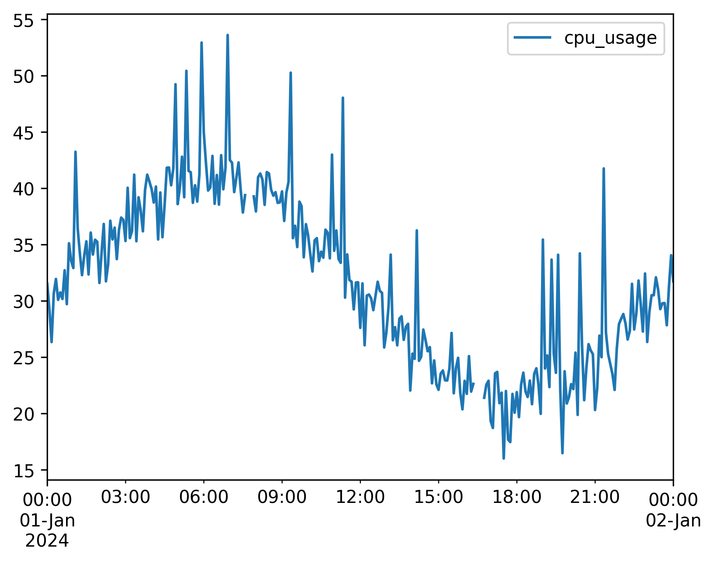

# Anomaly Injection

Anomalies are perturbations applied to metrics **after** the base mathematical trends have been computed. This decoupled design is critical: it keeps the clean baseline mathematical trend completely separate from the failure events.

This makes it exceptionally easy to benchmark anomaly detection models or test systems under failure conditions, as you can compare clean baselines with contaminated streams to get perfect ground-truth labels.

---

## 🛑 Available Anomaly Types

All anomaly classes are located in `ts_data_generator.anomalies`. They are applied stochastically based on your configuration.

### 1. `PointAnomaly`
Injects isolated spikes or drops in the metric value at individual timestamps.
*   `probability` (float): Probability in $[0, 1]$ of an anomaly occurring at any given timestamp (default `0.01`).
*   `mode` (`"additive"` or `"replacement"`):
    *   `"additive"`: Adds the magnitude to the trend's value ($y_{new} = y_{base} + \text{magnitude}$). Useful for simulating power spikes or network surges.
    *   `"replacement"`: Overwrites the trend's value with the magnitude ($y_{new} = \text{magnitude}$). Useful for simulating dead sensors locking to a specific extreme value.
*   `magnitude` (float or tuple[float, float]): A fixed scalar magnitude, or a `(min, max)` range tuple. If a tuple is provided, values are sampled uniformly.

```python
# API:
from ts_data_generator.anomalies import PointAnomaly

# 1. Additive spikes of random height
random_spikes = PointAnomaly(probability=0.02, mode="additive", magnitude=(50.0, 100.0))

# 2. Replacement spikes locking to exactly 999.0
dead_locks = PointAnomaly(probability=0.01, mode="replacement", magnitude=999.0)
```
```bash
# CLI Shorthand:
PointAnomaly(probability=0.02,mode='additive',magnitude=(50,100))
```

---

### 2. `MissingData`
Simulates sensor failures, transmission drops, or periodic maintenance outages by injecting `NaN` values.
*   `mode` (`"random"`, `"burst"`, or `"patterned"`):
    *   `"random"`: Every individual timestamp has an independent probability of dropping out.
    *   `"burst"`: Simulates multi-interval network dropouts. Once a dropout starts, it holds `NaN` for a contiguous block of steps.
    *   `"patterned"`: Gaps are injected on a strict schedule. (API only - requires a callable).
*   `probability` (float): Probability for `"random"` mode (default `0.01`).
*   `burst_probability` (float): Probability of a burst gap starting at any timestamp (default `0.02`).
*   `min_length` (int): Minimum duration (in steps) of a burst gap (default `2`).
*   `max_length` (int): Maximum duration (in steps) of a burst gap (default `5`).
*   `schedule` (Callable[[pd.Timestamp], bool]): A function that takes a timestamp and returns `True` if that timestamp should be dropped. Required for `"patterned"` mode.

```python
# API (Stochastic drops):
from ts_data_generator.anomalies import MissingData

# Random 5% individual dropouts
random_drops = MissingData(mode="random", probability=0.05)

# Network burst drops lasting between 5 and 20 steps
network_outage = MissingData(mode="burst", burst_probability=0.01, min_length=5, max_length=20)

# API (Schedule-based patterned drops):
# Simulate weekly maintenance drops every Sunday
sunday_maintenance = MissingData(
    mode="patterned",
    schedule=lambda ts: ts.weekday() == 6
)
```
```bash
# CLI Shorthand (Random & Burst only):
MissingData(mode='burst',burst_probability=0.01,min_length=5,max_length=20)
```

---

### 3. `ConceptDrift`
Simulates gradual distribution-level shifts in metrics (e.g. baseline shifts due to device degradation, seasonal HVAC changes, or system recalibrations). 

Drift is defined by passing an ordered list of `DriftSegment` objects to the `ConceptDrift` anomaly injector.

#### `DriftSegment` Parameters:
*   `start_timestamp` (str or pd.Timestamp): The absolute timestamp where the drift transition starts.
*   `transition_window` (float): The duration **in seconds** to transition gradually from the old baseline to the drifted baseline (default `1800` = 30 mins). A linear interpolation is used.
*   `target_mean` (float): The mean value of the new drifted distribution (default `0.0`).
*   `target_std` (float): The standard deviation of the new drifted distribution (default `1.0`).
*   `hold_duration` (float): The duration **in seconds** to hold/remain in the drifted regime (default `7200` = 2 hours).
*   `restore` (bool): If `True`, the pipeline will gradually transition back to the original baseline distribution over another `transition_window` immediately after the hold duration (default `False`).

#### The Drift Segment Timeline:
```
  [Clean Baseline]
         |
  [start_timestamp]
         |  \   <-- transition_window (Linear interpolation to target distribution)
         |   \
         +----+ <-- hold_duration (Gaussian distribution: target_mean, target_std)
               \
                \ <-- transition_window (Optional restore back to baseline)
                 |
          [Clean Baseline]
```

```python
# API (Overheating Event with Restore):
from ts_data_generator.anomalies import ConceptDrift, DriftSegment

overheat = ConceptDrift(segments=[
    DriftSegment(
        start_timestamp="2024-01-05T12:00:00",
        transition_window=3600,  # 1 hour to ramp up
        target_mean=95.0,         # Shifts average to 95 degrees
        target_std=2.0,           # With tight volatility
        hold_duration=14400,     # Overheats for 4 hours
        restore=True             # Gradually cools back down to normal
    )
])
```
```bash
# CLI Shorthand:
ConceptDrift(segments=[DriftSegment(start_timestamp='2024-01-05T12:00:00',transition_window=3600,target_mean=95,target_std=2,hold_duration=14400,restore=True)])
```

---

## 🥞 Stacking Multiple Anomalies

You can apply multiple anomalies to the same metric. The generation engine applies them sequentially in the order they are listed in your Python array or terminal command.

Here is a fully runnable Python API script demonstrating trend composition and stacked anomalies (spikes + dropouts):

```python
from ts_data_generator import DataGen
from ts_data_generator.utils.trends import SinusoidalTrend, LinearTrend
from ts_data_generator.anomalies import PointAnomaly, MissingData

# 1. Setup Generator
dg = DataGen(seed=999)
dg.start_datetime = "2024-01-01"
dg.end_datetime = "2024-01-02"
dg.to_granularity("5min")

# 2. Setup Base Trends (Baseline CPU)
cpu_trends = {
    LinearTrend(offset=30.0, slope=15.0), # Creeping baseline load
    SinusoidalTrend(amplitude=10.0, freq=1.0, noise_level=2.0) # Daily cycles
}

# 3. Setup Anomalies to stack
spikes = PointAnomaly(probability=0.05, mode="additive", magnitude=(10.0, 15.0))
outages = MissingData(mode="burst", burst_probability=0.01, min_length=2, max_length=4)


# 4. Add Metric (providing both trends and the ordered anomalies list)
dg.add_metric(
    name="cpu_usage",
    trends=cpu_trends,
    anomalies=[spikes, outages]
)

# 5. Plot
dg.plot()
```

Output:


### Stacking via the CLI
In the CLI, use the `+` operator to chain anomaly classes:

```bash
tsdata generate \
  --start 2024-01-01 --end 2024-01-05 --granularity h \
  --mets "cpu_usage:LinearTrend(offset=30,slope=25)+SinusoidalTrend(amplitude=10,freq=1)" \
  --anomalies "cpu_usage:PointAnomaly(probability=0.015,magnitude=(30,50))+MissingData(mode=burst,burst_probability=0.01)" \
  --output cpu_telemetry.csv
```
