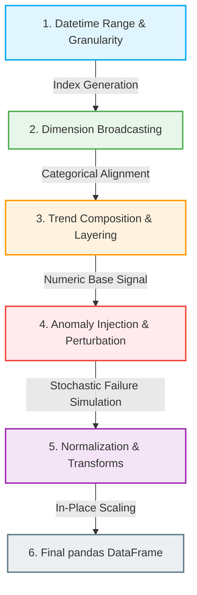

# Core Concepts

`ts-data-generator` builds realistic time series data by executing a deterministic, multi-stage pipeline. Instead of trying to generate whole datasets as a single block of values, it models time series as a set of decoupled **primitives** that are combined sequentially.

Understanding how these primitives work and interact is key to generating high-fidelity datasets.

---

## 📐 The Lifecycle of Data Generation

Every dataset goes through a five-stage processing pipeline. This pipeline ensures that context (dimensions), mathematical signals (trends), errors (anomalies), and scales (normalization) are resolved in a strict, logical sequence.

Here is the sequential flow of execution:

---

## 🏛️ The Three Primary Primitives

The core architecture relies on three distinct primitives:

### 1. Dimensions (Context)
Dimensions represent the **contextual axes** of your time series data (e.g., `store_id`, `region`, `ip_address`, `client_version`).
*   **Infinite Iteration**: Dimensions are implemented as infinite Python iterators (`generators`). This ensures they can produce values for a series of any length without exhausting memory.
*   **Broadcasting**: When multiple dimensions are combined, they are mapped across the datetime index. When using dimensions, the generator produces multi-variate series where metrics are generated for each unique dimensional combination (e.g., revenue generated per store, per region, per timestamp).

[Learn more about Dimension Generators]({{ site.baseurl }}/dimensions){: .btn .btn-outline }

### 2. Metrics & Trends (Base Signal)
Metrics represent the **numeric observations** you want to track (e.g., `cpu_utilization`, `sales_revenue`, `temperature`).
*   **Compositional Math**: A metric is not defined by a single equation. Instead, you compose it by summing multiple **Trends** together:
    $$\text{Metric}(t) = \sum \text{Trend}_i(t)$$
*   **Modular Layers**: This allows you to stack a stable base level (`LinearTrend`), a periodic daily oscillation (`SinusoidalTrend`), a weekend drop-off (`WeekendTrend`), and autocorrelated volatility (`ARNoiseTrend`) to easily build highly complex signals.

[Learn more about Trend Functions]({{ site.baseurl }}/trends){: .btn .btn-outline }

### 3. Anomalies (Perturbation)
Anomalies represent **real-world failure events** or regime shifts (e.g., network spikes, missing sensor data, or system recalibration drift).
*   **Decoupled Intervention**: Anomalies are injected *after* the base metrics are generated. This is critical: it keeps the clean baseline mathematical trend completely separate from the failure events.
*   **Stochastic Perturbation**: You specify the rules (e.g., a $2\%$ chance of a network drop-out lasting $3$ to $5$ consecutive intervals). The pipeline stochastically modifies the base array in place. This makes benchmarking anomaly detection models exceptionally easy because you can compare the clean baseline against the contaminated dataset to get perfect labels.

[Learn more about Anomaly Injection]({{ site.baseurl }}/anomalies){: .btn .btn-outline }

---

## 🚀 Secondary Transforms

Once the primitives are fully composed and stochastically contaminated, `ts-data-generator` provides post-processing transforms to make the data model-ready:

*   **Coarser Aggregation**: Easily resample your generated granular data (e.g., converting 5-minute raw sensor logs to 1-hour average logs) while automatically respecting each metric's specific aggregation rules (e.g., taking the `AVG` of temperature but the `SUM` of revenue).
*   **Normalization**: Scale your numeric data in place using standard methods like `min-max` scaling or `mean-std` Z-score normalization, with built-in support for exact denormalization (restoration).
