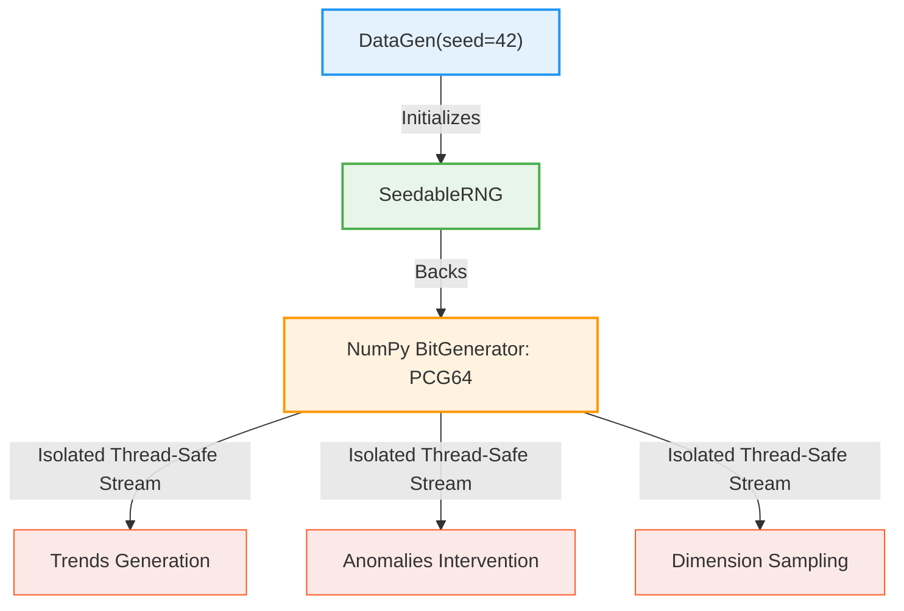

# Deterministic Generation

One of the core architectural design goals of `ts-data-generator` is **100% reproducibility**. Given the exact same seed value and configuration, the library will produce the identical, bit-for-bit identical DataFrame every single time, regardless of what machine, operating system (macOS, Linux, Windows), or Python version it is executed on.

---

## ⚙️ How it Works under the Hood

Typical synthetic data libraries rely on global randomness pools, like `random.seed()` or `np.random.seed()`. This approach is highly fragile:
*   Other imported third-party libraries (e.g. Pandas, Scipy, or web frameworks) can alter or advance the global seed state silently.
*   Global state is not thread-safe. Running multiple generators concurrently in a task queue will corrupt the states and result in non-reproducible data.

To prevent this, `ts-data-generator` completely bypasses the global random states. Instead, it encapsulates randomness in a dedicated, isolated class called `SeedableRNG` (located in `ts_data_generator.random`).



### 1. Isolated PCG64 Engine
When you initialize `DataGen(seed=12345)`, a private `SeedableRNG` object is created. Under the hood, this object initializes a private `numpy.random.Generator` backed by the modern, highly secure **PCG64** pseudo-random number generator (PRNG) algorithm.

### 2. Deep Seeding Propagation
This isolated `rng` instance is passed directly down into every individual Trend, Anomaly, and Dimension generator during the execution of the building pipeline. Every single decision (like stochastically triggering a `PointAnomaly` spike or sampling a random choice dimension) uses only this passed-down `rng` instance.

### 3. Unified RNG Protocol
Previous versions relied on a hypothetical seam (`if rng is not None`) and a global NumPy fallback. The library now enforces a strict `RNGProtocol` interface. `DataGen` uses either a `SeedableRNG` (when seeded) or a `DefaultRNG` (which encapsulates unseeded global generation), guaranteeing that the random number generator object is *always* available to the underlying trends and anomalies without repetitive branching.

When writing a custom trend or anomaly, you no longer need to check if `rng` is `None`—simply use `rng.normal(loc, scale, size)` or `rng.choice(...)`.

---

## 🐍 Python & CLI Usage

### Python API
Simply pass a fixed integer seed to the `DataGen` initializer:

```python
from ts_data_generator import DataGen
from ts_data_generator.utils.trends import SinusoidalTrend

# Run A
dg_a = DataGen(seed=42)
dg_a.start_datetime = "2024-01-01"
dg_a.end_datetime = "2024-01-02"
dg_a.to_granularity("h")
dg_a.add_metric("usage", {SinusoidalTrend(amplitude=10, freq=1, noise_level=1.0)})
df_a = dg_a.data

# Run B (Exact same seed)
dg_b = DataGen(seed=42)
dg_b.start_datetime = "2024-01-01"
dg_b.end_datetime = "2024-01-02"
dg_b.to_granularity("h")
dg_b.add_metric("usage", {SinusoidalTrend(amplitude=10, freq=1, noise_level=1.0)})
df_b = dg_b.data

# Verify bit-for-bit identity
assert df_a.equals(df_b)
print("DataFrames are perfectly identical!")
```

### CLI Generation
Pass the `--seed` or `-s` parameter:

```bash
tsdata generate \
  --start 2024-01-01 --end 2024-01-02 --granularity h \
  --mets "usage:SinusoidalTrend(amplitude=10,freq=1,noise_level=1.0)" \
  --seed 42 \
  --output run_a.csv
```

---

## 💎 Why This is Critical

*   **Model Regression Testing**: When benchmarking forecasting or anomaly detection algorithms, you must feed them the exact same data to see if code tweaks improve or degrade performance. If the dataset changes stochastically each run, your tests are meaningless.
*   **Zero Storage Collaboration**: Instead of sharing 5GB CSV files with colleagues or uploading them to cloud storage, you can simply share a 200-byte JSON config file containing the seed. When your colleague runs the config, they will get the exact same dataset.
*   **Production Debugging**: If a stochastically-generated anomaly triggers a rare crash in your edge processing pipeline, you can re-generate the exact same failure scenario using the seed to step-through and debug.
