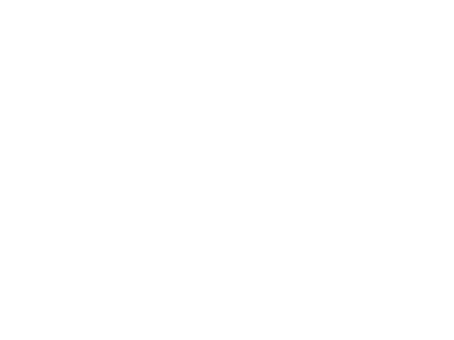
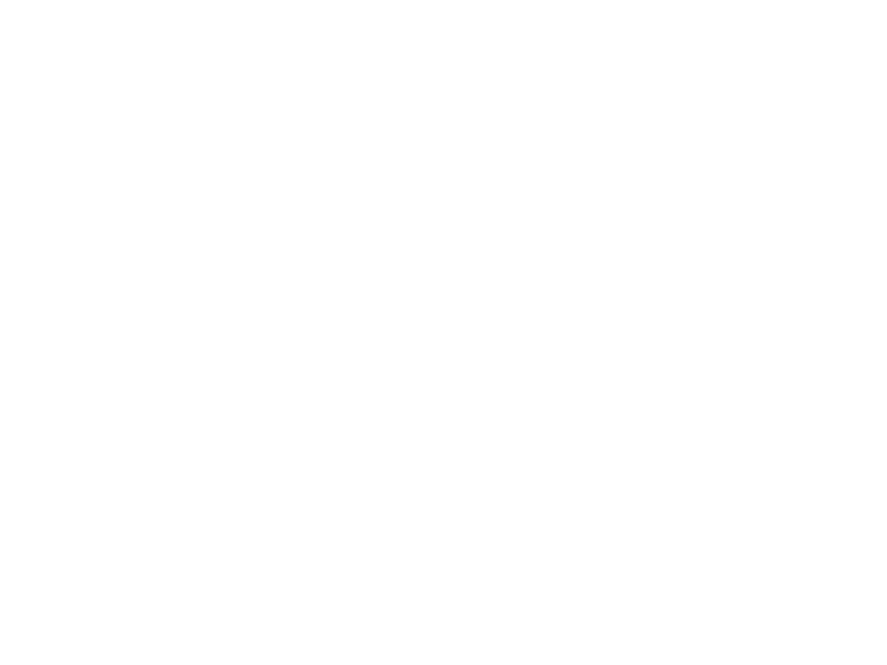

# Visualization

`ts-data-generator` provides clean built-in plotting utilities to quickly inspect and verify your generated signals. Additionally, since the engine outputs standard **Pandas DataFrames**, you can seamlessly plug the output into popular visualization libraries like Seaborn, Matplotlib, or Plotly for advanced reporting.

---

## 📈 Built-in Native Plotting

The `DataGen` class contains a `.plot()` method that leverages `matplotlib` to render quick line charts of your generated numeric metrics.

```python
from ts_data_generator import DataGen
from ts_data_generator.utils.trends import SinusoidalTrend, LinearTrend

dg = DataGen(seed=42)
dg.start_datetime = "2024-01-01"
dg.end_datetime = "2024-01-04"
dg.to_granularity("h")

# Composing a metric
dg.add_metric("temperature", {LinearTrend(offset=15.0, slope=2), SinusoidalTrend(amplitude=5, freq=1)})
dg.add_metric("humidity", {SinusoidalTrend(amplitude=15, freq=1)})

df = dg.data

# 1. Quick Native Plot (Plots all numeric columns)
dg.plot()
```

### Filtering Columns
You can easily control which metrics are rendered using the `include` or `exclude` parameters:

```python
# Renders ONLY the temperature line
dg.plot(include=["temperature"])

# Renders everything EXCEPT humidity (e.g. useful to hide high-scale metrics)
dg.plot(exclude=["humidity"])
```

---

## 🎨 Advanced Plotting with External Libraries

Because `dg.data` returns a standard Pandas DataFrame, you have total design control. Below are three copy-pasteable snippets for professional, premium quality visualizations.

### 1. Seaborn (Multi-Facet & Styling)
Seaborn is perfect for plotting metrics grouped by categorical dimensions (like regions or environments).

```python
import seaborn as sns
import matplotlib.pyplot as plt
from ts_data_generator import DataGen
from ts_data_generator.utils.functions import random_choice
from ts_data_generator.utils.trends import SinusoidalTrend

# Setup multi-variate generation
dg = DataGen(seed=42)
dg.start_datetime = "2024-01-01"
dg.end_datetime = "2024-01-03"
dg.to_granularity("h")

dg.add_dimension("region", random_choice(["North", "South"]))
dg.add_metric("temperature", {SinusoidalTrend(amplitude=10, freq=1)})

df = dg.data.reset_index() # Seaborn works best with long-format columns

# Styling parameters
sns.set_theme(style="whitegrid")
plt.figure(figsize=(12, 6))

# Line plot grouped by region
sns.lineplot(
    data=df, 
    x="index", 
    y="temperature", 
    hue="region", 
    linewidth=2.5,
    palette="muted"
)

plt.title("Temperature Seasonal Variations by Region", fontsize=14, fontweight="bold", pad=15)
plt.xlabel("Timestamp", fontsize=12)
plt.ylabel("Degrees Celsius", fontsize=12)
plt.tight_layout()
plt.show()
```

Output:

---

### 2. Plotly (Interactive & Dynamic Zoom)
Plotly allows you to hover over spikes, zoom in on stochastically placed anomalies, and export interactive HTML dashboards.

```python
import plotly.express as px
from ts_data_generator import DataGen
from ts_data_generator.utils.trends import StockTrend

# Setup a stock price simulation
dg = DataGen(seed=777)
dg.start_datetime = "2024-01-01"
dg.end_datetime = "2024-01-07"
dg.to_granularity("5min")
dg.add_metric("asset_price", {StockTrend(amplitude=150.0, noise_level=0.1)})

df = dg.data

# Render beautiful, interactive Plotly line chart
fig = px.line(
    df, 
    y="asset_price", 
    title="Simulated Asset Price Walk (5-Min Granularity)",
    labels={"index": "Timestamp", "asset_price": "Price (USD)"},
    template="plotly_dark" # Premium sleek dark mode
)

# Customize layout lines
fig.update_xaxes(rangeslider_visible=True) # Adds a timeline range slider
fig.update_traces(line_color="#00D2FF", line_width=1.5)
fig.show()
```

<iframe
    src="./assets/simulated_asset_price_chart.html"
    width="100%"
    height="600"
    frameborder="0">
</iframe>
---

### 3. Correlation Heatmap
If you have generated many metric columns, plotting a correlation matrix heatmap helps verify how your metrics behave relative to each other.

```python
import seaborn as sns
import matplotlib.pyplot as plt

dg = DataGen()
dg.start_datetime = "2024-01-01"
dg.end_datetime = "2024-01-30"
dg.to_granularity("D")

# 2. Setup Base Trends (Baseline CPU)
cpu_trends = {
    LinearTrend(offset=30.0, slope=-15.0), # Creeping baseline load
    SinusoidalTrend(amplitude=10.0, freq=1.0, noise_level=2.0) # Daily cycles
}

gpu_trends = {
    LinearTrend(offset=20.0, slope=10.0), # Lower baseline load
    SinusoidalTrend(phase=0.5, amplitude=5.0, freq=2.0, noise_level=1.0) # Daily cycles
}

ram_trends = {
    LinearTrend(offset=50.0, slope=5.0), # Increasing baseline load
    SinusoidalTrend(phase=0.25, amplitude=15.0, freq=0.5, noise_level=3.0) # Longer cycles
}

memory_usage_trends = {
    LinearTrend(offset=40.0, slope=2.0), # Steady baseline
    SinusoidalTrend(phase=0.75, amplitude=20.0, freq=0.25, noise_level=4.0) # Very long cycles
}

# 3. Setup Anomalies to stack
spikes = PointAnomaly(probability=0.05, mode="additive", magnitude=(10.0, 15.0))
outages = MissingData(mode="burst", burst_probability=0.01, min_length=2, max_length=4)


# 4. Add Metric (providing both trends and the ordered anomalies list)
dg.add_metric(
    name="cpu_usage",
    trends=cpu_trends,
    anomalies=[spikes, outages]
)
dg.add_metric(
    name="gpu_usage",
    trends=gpu_trends,
    anomalies=[spikes, outages]
)
dg.add_metric(
    name="ram_usage",
    trends=ram_trends,
    anomalies=[spikes, outages]
)

dg.add_metric(
    name="memory_usage",
    trends=memory_usage_trends,
    anomalies=[spikes, outages]
)

df = dg.data.drop(columns=["epoch"]) # Drop dimension for correlation analysis

plt.figure(figsize=(8, 6))
sns.heatmap(
    df.corr(), 
    annot=True, 
    cmap="coolwarm", 
    fmt=".2f", 
    linewidths=.5,
    square=True
)
plt.title("Metrics Correlation Heatmap", fontsize=12, fontweight="bold")
plt.tight_layout()
plt.show()
```

Output:

---
